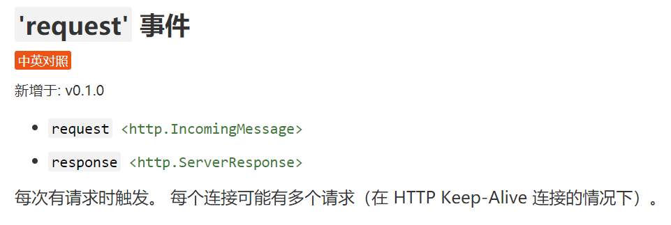
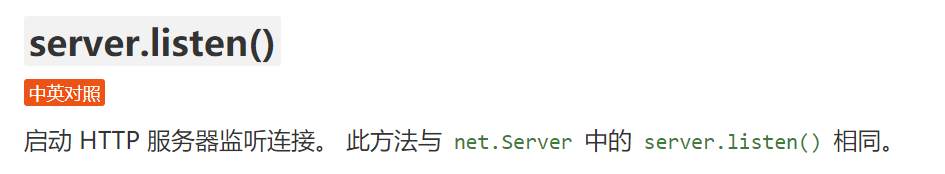

# node-server:基于Node.js http模块  搭建静态服务器

***

## 重要API——http.createServer( )

用http.createServer( )创建一个server实例

```javascript
import * as http from "http";
const server = http.createServer();
```

根据[官方文档](http://nodejs.cn/api-v14/http.html#class-httpserver)，知道`http.createServer( )`函数返回的是http.Server类的实例，该实例拥有几个事件和方法，其中有**request 事件**和**listen方法**比较重要。





## 请求Request

是http.IncomingMessage的实例，拥有method，url，headers等属性，以及从 stream.Readable类继承了 **data/end/error事件**。

```javascript
request.method    获取请求动词  GET/POST
request.url       获取请求路径（含查询参数）
request.headers   获取请求头 
```

## 响应Response

继承自http.ServerResponse 的实例，继承自Stream，拥有getHeader/setHeader/end/write 等方法，statusCode属性，可读可写。

```javascript
response.statusCode = 400; //更改状态码
response.setHeader("x-lucy", `I am lucy`); //设置响应头
response.write("1\n"); //设置响应体
response.end();        //响应结束
```

参考：[官方文档](http://nodejs.cn/api-v14/http.html#class-httpserver)